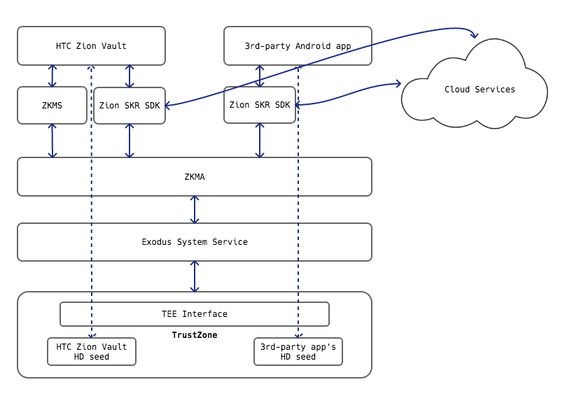
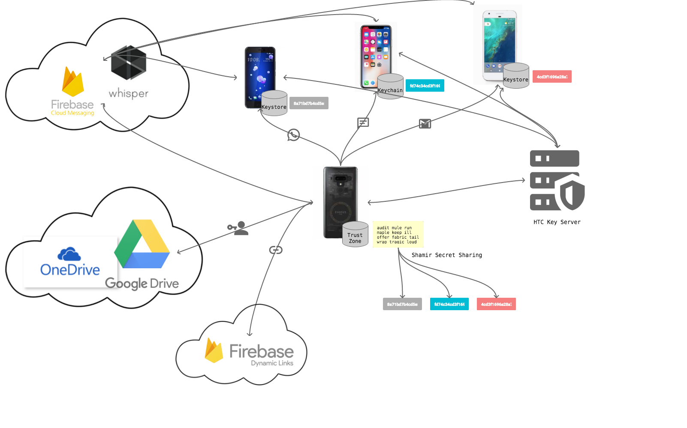

# Zion Social Key Recovery SDK
[](https://travis-ci.com/htczion/Zion-SKR-SDK)


## Introduction

Zion Social Key Recovery SDK (Zion-SKR-SDK) is an Android library that provides Java APIs for developers to integrate HTC Zion Vault's Social Key Recovery (SKR) feature into their apps. 3rd party apps integrating Zion-SKR-SDK will be able to use SKR to backup or restore their hierarchical deterministic (HD) wallet seed on HTC EXODUS phones. For details about SKR, see the HTC EXODUS official website at the link below.  
[https://www.htcexodus.com/us/support/exodus-one/faq/what-is-social-key-recovery-and-why-use-it.html](https://www.htcexodus.com/us/support/exodus-one/faq/what-is-social-key-recovery-and-why-use-it.html)




## Architecture

The architecture diagram below illustrates component interaction in Social Key Recovery.



* Wallet app
  * Android  
  The Android app serves as an HD wallet, allowing users to manage their digital assets, as well as backup and restore their HD wallet. For managing assets, such as sending or receiving bitcoin, see [ZKMA](https://github.com/htczion/ZKMA). Check out HTC Zion in the Play Store [https://play.google.com/store/apps/details?id=com.htc.wallet&hl](https://play.google.com/store/apps/details?id=com.htc.wallet&hl])).

  * iOS  
  The iOS app allows the user to backup partial seeds for trusted contacts. Check out HTC Zion in the iOS App Store, [https://apps.apple.com/tw/app/htc-zion/id1442810459](https://apps.apple.com/tw/app/htc-zion/id1442810459)).

* TrustZone  
  * Quote from [Wikipedia](https://en.wikipedia.org/wiki/Trusted_execution_environment)
  > A trusted execution environment (TEE) is a secure area of a main processor. It guarantees code and data loaded inside to be protected with respect to confidentiality and integrity[clarification needed].[1] A TEE as an isolated execution environment provides security features such as isolated execution, integrity of applications executing with the TEE, along with confidentiality of their assets.[2] In general terms, the TEE offers an execution space that provides a higher level of security[for whom?] than a rich mobile operating system open (mobile OS) and more functionality than a 'secure element' (SE).[3]
  * The user's seed is stored securely in the TrustZone.
  * Seed splitting and sharing uses Shamir's secret sharing, implemented inside the TrustZone. SSS implementation uses [SSS from dsprenkels](https://github.com/dsprenkels/sss). 
  * Only encrypted partial seeds will be sent to Android.
* Cloud storage  
  * The user's trusted contact list is saved with cloud storage. Its purpose is to remind the user who they have asked to help backup.
* Cloud messaging  
  * Data exchange uses cloud messaging. Currently, this is implemented with Firebase Cloud Messaging (FCM).
* Deep links  
  * Deep links are used for initial connection set up. Currently, this is implemented with Firebase Dynamic Links.

## Flow

Sequence diagram describing the partial seed backup flow with friend.  

Sequence diagram describing the partial seed restore flow with friend. 


## Usage

1. Integration guide for using Zion-SKR-SDK to backup and restore seeds on an HTC EXODUS:
  * [https://github.com/htczion/Zion-SKR-SDK/wiki](https://github.com/htczion/Zion-SKR-SDK/wiki)
2. Applying and integrating related cloud services:
  * [https://github.com/htczion/Zion-SKR-SDK/wiki](https://github.com/htczion/Zion-SKR-SDK/wiki)
3. Applying for HTC Public Key Server access:  
 Send an email to [Hank_Chiu@htc.com](mailto:hank_chiu@htc.com) with the following information:
  * Full name, e.g., Hank Chiu
  * Company name, e.g., HTC
  * Email address
  * App name, e.g., HTC Zion
  * App's package name, e.g., "com.htc.wallet"
  * App's SHA256 signature (Base64 encoded), e.g., xpghBVzbMWoosDUOJl1/trHXXlSBBilUanBSiwVe/rk=
 ```
 # keytool -list -printcert -jarfile app-partner-release.apk  
  ...
   SHA256: C6:98:21:05:5C:DB:31:6A:28:B0:35:0E:26:5D:7F:B6:B1:D7:5E:54:81:06:29:54:6A:70:52:8B:05:5E:FE:B9
  ...
 # echo "C6:98:21:05:5C:DB:31:6A:28:B0:35:0E:26:5D:7F:B6:B1:D7:5E:54:81:06:29:54:6A:70:52:8B:05:5E:FE:B9" | xxd -r -p | base64  
  xpghBVzbMWoosDUOJl1/trHXXlSBBilUanBSiwVe/rk=
 ```   


## Gradle plugin integration

1. Copy the .aar file into your app project library path:  
    \<Project Name\>\app\libs\ZionSkrSdk-release.aar  
2. Add following dependency to your build.gradle:  

```gradle
dependencies {
  implementation(name: 'ZionSkrSdk-release', ext: 'aar')     
}
```

For details, refer to [https://github.com/htczion/Zion-SKR-SDK/wiki](https://github.com/htczion/Zion-SKR-SDK/wiki).


## License

Copyright (c) 2019 HTC Corporation. All rights reserved.

Licensed under the Apache License, Version 2.0 (the "License");
you may not use this file except in compliance with the License.
You may obtain a copy of the License at

http://www.apache.org/licenses/LICENSE-2.0

Unless required by applicable law or agreed to in writing, software
distributed under the License is distributed on an "AS IS" BASIS,
WITHOUT WARRANTIES OR CONDITIONS OF ANY KIND, either express or implied.
See the License for the specific language governing permissions and
limitations under the License.
